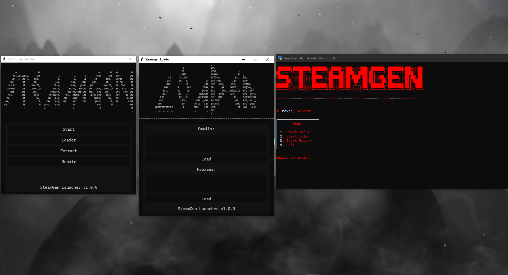

# SteamGen

A fully autonomous steam account generator with email auto verification and a game idler, it also has the ability to use proxies and the dot method on any email provider!



## Pros & Cons
___
#### General stuff

| Pros                          | Cons                                      |
|-------------------------------|-------------------------------------------|
| [ + ] Cheap                   | [ - ] Only HQ proxies                     |
| [ + ] Fully autonomous        | [ - ] Email verification needs dot method |
| [ + ] No need to install libraries manually | [ - ] Python 3.11 needed    |
___
#### Premium

| Pros                          | Cons                                      |
|-------------------------------|-------------------------------------------|
| [ + ] Cheap                   | [ - ] Only HQ proxies                     |
| [ + ] Fully autonomous        | [ - ] Email verification needs dot method |
| [ + ] Game Idler              | [ - ] A bit more complex to use           |
___
#### Basic

| Pros                          | Cons                                      |
|-------------------------------|-------------------------------------------|
| [ + ] Cheaper                 | [ - ] Only HQ proxies                     |
| [ + ] Semi autonomous         | [ - ] No auto mail verification           |
| [ + ] Simpler to use          | [ - ] Less features                       |
___
# SteamGen Prices

## Key Types
- Premium
  * Server
  * Dotter
  * Game Idler
  * Auto Mail Verifier

```
Price: $10 per key
Duration: 1 month
Support: High priority
```

- Basic
  * Server
  * Dotter

```
Price: $5 per key
Duration: 1 month
Support: Normal priority
```
# REBOOT INCOMING!!!

# Socials

<p align="center" >
  <b> >>> JOIN THE DISCORD <<< </b>
    <br>
  https://discord.gg/PdeTUZ3M62
</p>
